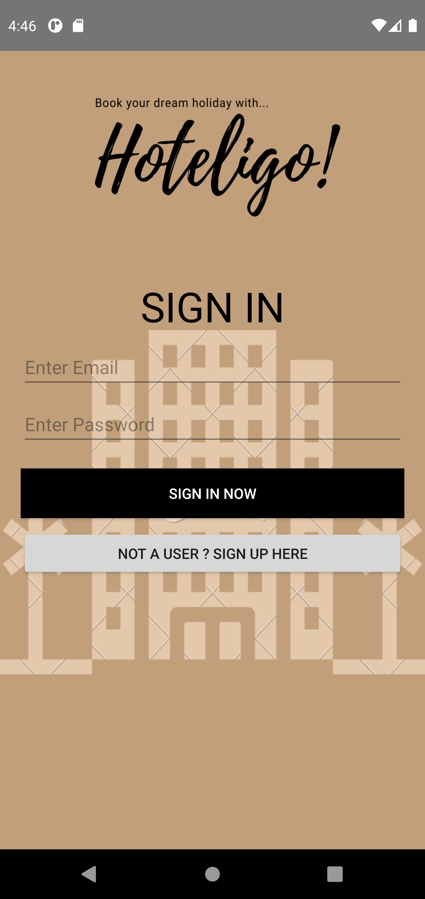
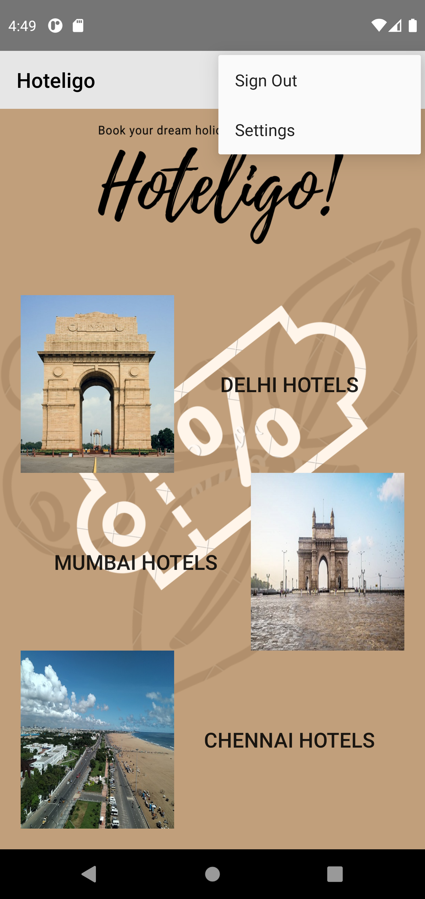
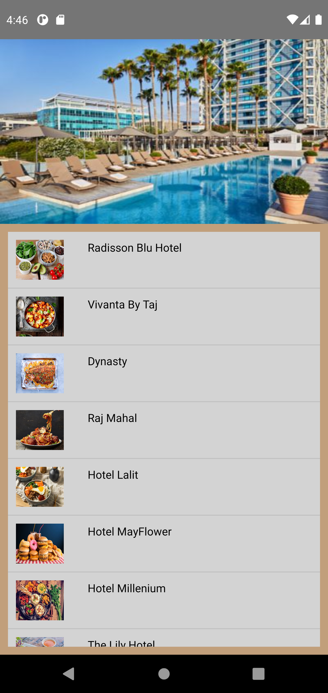
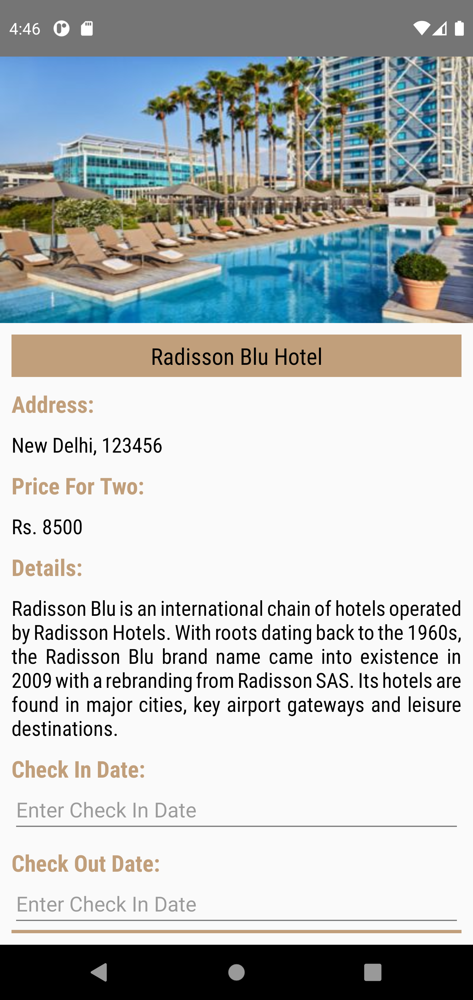
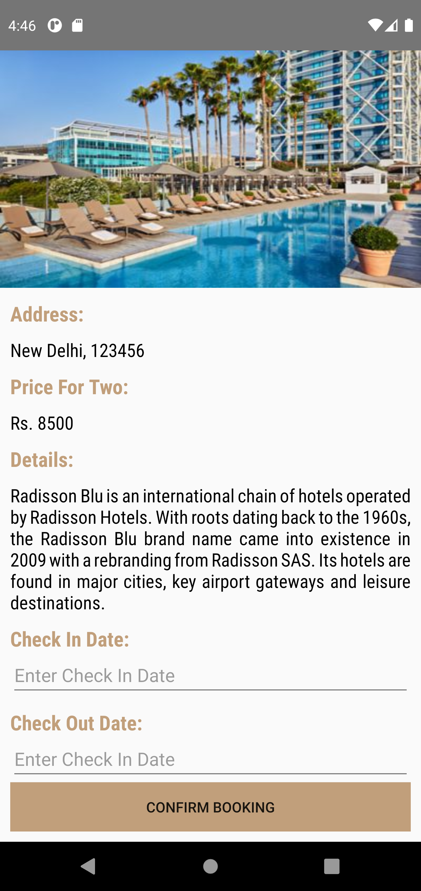

# Hoteligo-Android-Application

 

This application is a Hotel Booking Application

It uses Firebase as database and saves users and hotel information
The hotels in the application are also renderd using firebase database

If you want to edit the hotel details go to the [Hoteligo Admin Application](https://github.com/vishwaksena-vishnu/Hoteligo-Admin-Application)

Sign In and Sign Up Images:

 

Home and Hotel List Images:

 

Hotel Booking Images:

 